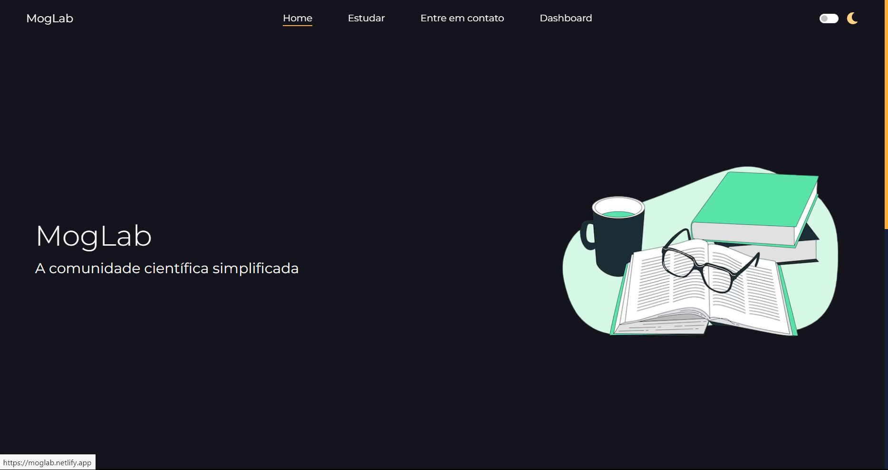
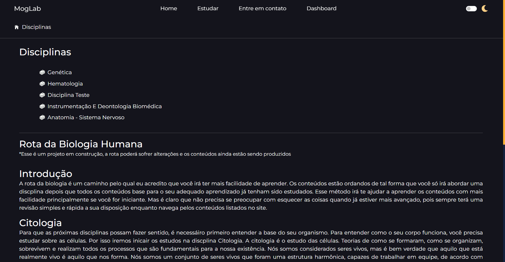
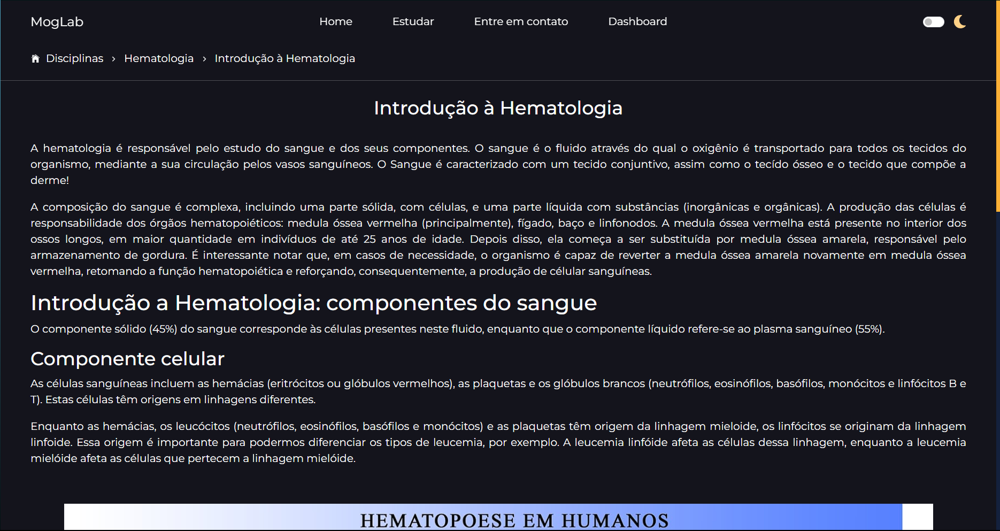
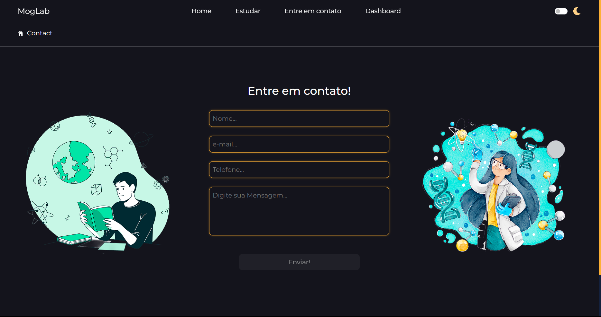
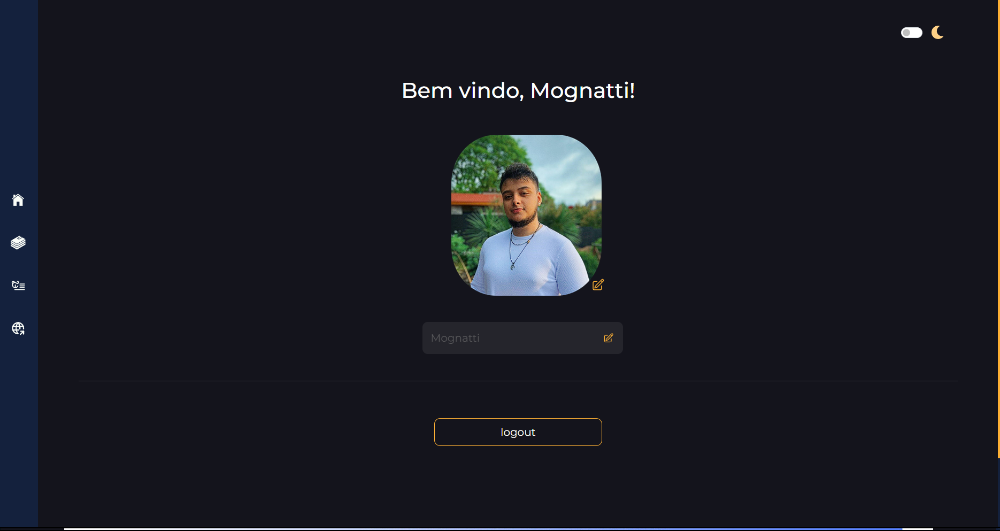
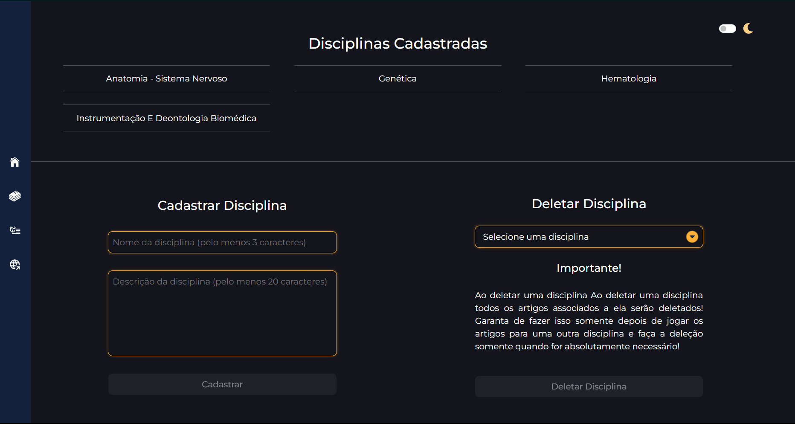
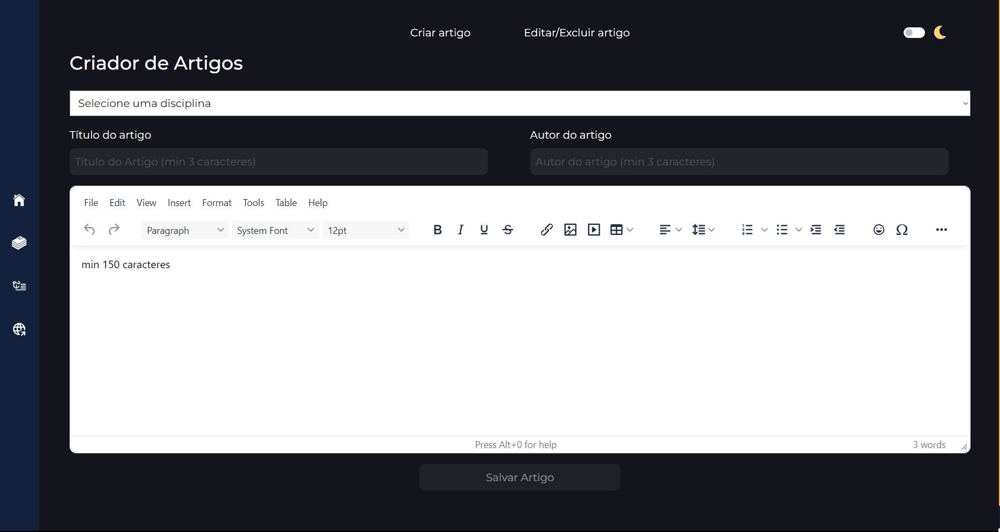
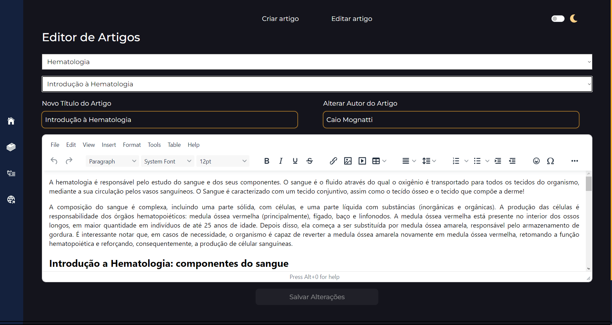
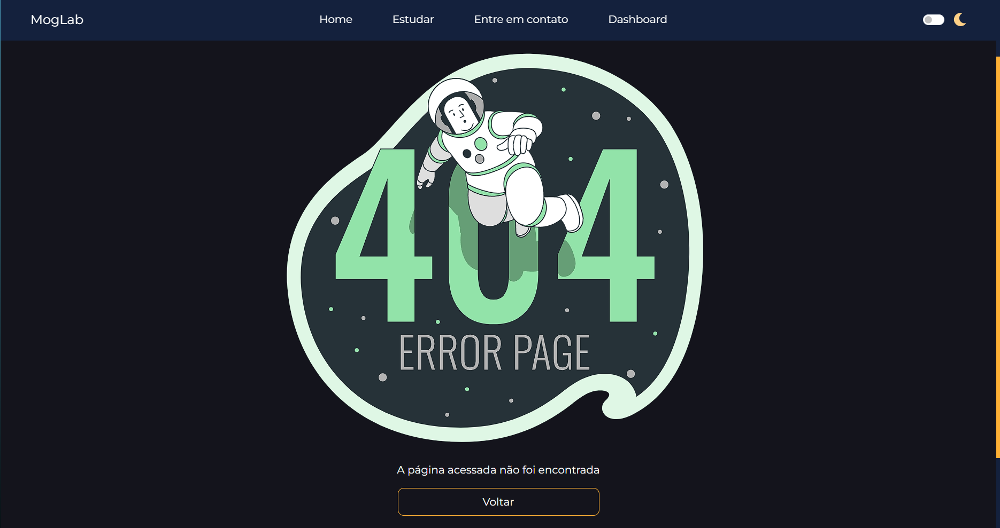

<h1 align='center'>MogLab - A Comunidade Científica Descomplicada</h1>

   <h4>Bem-Vindo(a) à Moglab!</h4>
   
Esse é o repositório do meu meior projeto de 2023/2024, uma aplicação Full-Stack que integra meus conhecimentos de Node.js, React.ts, Firebase e estrutura e modelagem de dados!

   
Foram muitas horas de trabalho, mas o projeto está finalmente finalizado (se é que um desenvolvedor consegue realmente considerar um projeto como finalizado 😅)

O MogLab tem a proposta de ser um site de ensino, voltado para estudantes das diversas áreas da saúde, com foco em Biomedicina (minha outra graduação 😉).

Através da aplicação, o usuário pode entrar em diferentes sessões. A principal sessão é chamada "Estudar", onde o usuário poderá selecionar uma disciplina cadastrada no banco de dados e, depois disso, escolher qual artigo dessa disciplina ele(a) irá ler.

A segunda sessão é "Entre em contato", onde o visitante poderá mandar um e-mail com alguma sugestão de conteúdo. Para isso funcionar, eu criei um e-mail chamado moglabsender, que fica responsável por fazer o envio. A lógica do envio fica na responsabilidade da API, através da biblioteca nodesender. O Front-End apenas faz a chamada no endpoint específico da API e esta última faz o resto!

Além disso, os administradores (os que seriam os funcionários da empresa) podem acessar uma área de gerenciamento de conteúdo, sendo capazes de cadastrar novas disciplinas ou excluir uma já existente. Além disso, podem cadastrar novos artigos para uma determinada disciplina ou alterar o conteúdo de um artigo que já esteja no sistema.
 

Esses administradores ainda podem cadastrar uma novo foto (que fica armazenada no firebase (storage) e mudar o nome cadastrado no sistema. Esse processo é feito com muito cuidado pela API, para garantir que somente um arquivo de imagem possa ser enviado por vez e ainda verifica se o tipo do arquivo é realmente compatível com o esperado, evitando ataques ao banco de dados.
 

Tudo isso é feito de maneira ágil e nunca entra em contato direto com o banco de dados, mas sim com a API em Node que busca uma arquitetura REST, capaz de auxiliar o desenvolvedor no processo de produção através do tratamento de erros e endpoints estruturadas.
 

A aplicação ainda conta com a possibilidade de trocar de tema (claro ou escuro) e é responsiva, para o adequado funcionamento em ambientes mobile.
 

Assim como em todo projeto, sempre fica aquela vontade de implementar mais funcionalidades, como login de visitantes para que possam acompanhar seu progresso em cada disciplina e etc. Assim como melhorias de código e otimização. Mas é importante saber a hora de partir para os próximos estudos! Então, por enquanto, o projeto está finalizado!
 

Se quiser dar uma olhadinha em como ficou, basta <a href='https://moglab.netlify.app'>clicar no link!</a> O design é responsivo, então pode usar tanto um celular quanto um PC 😎 

*lembre-se que o github não aceita target_balnk, então abre como uma nova guia!

<h2 align='center'>Preview da página</h2>
   
<h3 align='center'>Home page</h3>

<h3 align='center'>Estudar</h3>

<h3 align='center'>Disciplina</h3>

<h3 align='center'>Artigo</h3>

<h3 align='center'>Entre em Contato</h3>

<h3 align='center'>Admin Dashboard</h3>

<h3 align='center'>Editar disciplinas</h3>

<h3 align='center'>Criar Artigo</h3>

<h3 align='center'>Editar Artigos</h3>

<h3 align='center'>Not Found</h3>

